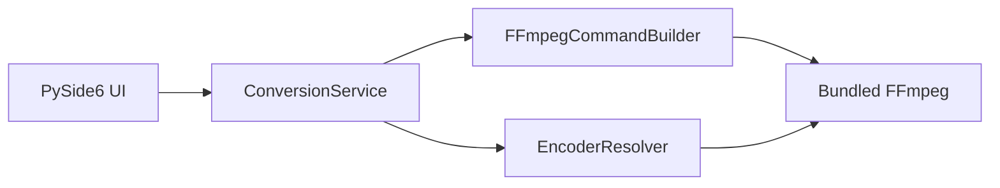

# デザイン設計

要件（[requirements.md](requirements.md)）を、モジュール境界と FFmpeg の使い方に落とし込む。完全なコマンドのコピペではなく、方針を固定する。

## 1. 全体構成



変換は UI スレッドで行わない。`ConversionService` がワーカーで FFmpeg プロセスを起動し、進捗と終了をシグナルで UI に返す。

FFmpeg は subprocess のみ。Python から libavcodec 等をリンクしない。

## 2. モジュール

想定ディレクトリ（実装時。本フェーズでは作成しない）:

```
src/pixelart_converter/
  ui/                 # ウィンドウ、ダイアログ、プレビュー
  conversion/
    service.py        # ConversionService
    command.py        # FFmpegCommandBuilder
    encoder.py        # EncoderResolver
    binary.py         # 同梱 ffmpeg のパス解決
  models.py           # 変換ジョブ（入力パス、出力形式、オプション）
```

| モジュール | 責務 |
|------------|------|
| UI | 入力・オプション・プレビュー・進捗。変換ロジックを持たない |
| ConversionService | ジョブ検証、プロセス起動、キャンセル、終了コードの解釈 |
| FFmpegCommandBuilder | ジョブから argv を組み立てる。OS 差分はエンコーダー名以外に極力出さない |
| EncoderResolver | 利用可能な H.264 エンコーダーをプローブし、優先順で 1 つ返す |
| binary | PyInstaller 同梱パス / 開発時の `vendor/` パスを解決する |

## 3. FFmpeg 同梱

### 3.1 配置

```
vendor/ffmpeg/
  macos/ffmpeg
  windows/ffmpeg.exe
  README.md          # ビルド設定、バージョン、LGPL であることの根拠
  COPYING.LGPLv3 等
```

バイナリはサイズが大きいため、リポジトリへのコミット方針は Phase 2 で決める（Git LFS、リリース資産、またはビルドスクリプトで生成）。

### 3.2 ビルド制約

- `--enable-gpl` しない
- `--enable-libx264` しない
- ハードウェアエンコーダー（VideoToolbox / Media Foundation）は有効にする
- ソフトウェアフォールバックを入れる場合のみ `--enable-libopenh264` を検討する

公開されている “full” ビルド（gyan.dev の full 等）は GPL + x264 であることが多い。**そのまま同梱しない。**

### 3.3 実行時パス

1. 環境変数で上書き（開発・テスト用）
2. PyInstaller の `_MEIPASS` 配下の同梱バイナリ
3. リポジトリの `vendor/ffmpeg/<os>/`

システム PATH の `ffmpeg` にはフォールバックしない（ライセンスの異なるバイナリを拾わないため）。

### 3.4 配布時のライセンス同梱

アプリ成果物に FFmpeg / Qt / PySide6 のライセンス全文と、FFmpeg ソースの入手方法（URL または同梱アーカイブ）を含める。詳細は [tasks.md](tasks.md) Phase 6。

## 4. EncoderResolver

変換前（または起動時キャッシュ）に、同梱 `ffmpeg -hide_banner -encoders` 相当でエンコーダーの有無を確認し、必要なら短いテストエンコードで実動作を見る。

**優先順**

1. OS ネイティブ HW  
   - macOS: `h264_videotoolbox`  
   - Windows: `h264_mf`
2. （採用した場合）`libopenh264`
3. なし → MP4 ジョブを失敗。メッセージで HW 非対応であることと、GPL ビルドへは切り替えないことを示す

OpenH264 のプロファイル（Constrained Baseline か Main か）は Phase 2 で実機検証し、本設計の「採用 / 非採用」と UI 上の注意書きを確定する。検証前に main profile 前提で実装しない。

## 5. 変換パイプライン

`FFmpegCommandBuilder` がジョブから argv を組む。共通オプションを先に決め、形式別を足す。

### 5.1 共通

| 項目 | 方針 |
|------|------|
| 入力 | `-i <input.gif>`。ループが必要な MP4 のみ、入力の前に `-stream_loop` を付ける |
| リサイズ | `scale=W:H`。未指定なら scale を付けない |
| スケールフラグ | 既定 `flags=neighbor`。bilinear / bicubic は UI の選択に従う |
| メタデータ削除オン | `-map_metadata -1`。必要ならコンテナ固有のコメント抑制も足す |
| メタデータ削除オフ | 上記を付けない（入力のメタデータをコピーしうる） |
| 上書き | 出力先が既にある場合は UI で確認してから `-y` |

ピクセルアートではニアレストネイバーが既定。スムージングが欲しい場合だけ他アルゴリズムを選ぶ。

### 5.2 MP4

- 映像: EncoderResolver が返したエンコーダー（`-c:v h264_videotoolbox` または `h264_mf` 等）
- 音声: GIF に音声は通常無い。音声ストリームは作らない
- **ループ回数 N**: 入力の前に `-stream_loop N-1`（FFmpeg の stream_loop は「追加で繰り返す回数」。N 周なら `N-1`）。オフバイワンは実装時にテストで確定する
- **秒数 T**: 入力を無限ループ（`-stream_loop -1`）し、出力に `-t T`
- ループ回数と秒数はジョブ上で排他。両方入っていたらサービス層で拒否
- ピクセルアート向けに、不要な品質劣化を避けるビットレート / 品質パラメータは Phase 3 で決める（HW エンコーダーごとにオプション名が違う）

コンテナは MP4、拡張子 `.mp4`。faststart（`-movflags +faststart`）は Web 配信が主目的ではないが、互換のため付けてよい。

### 5.3 JPEG / PNG

- フィルタでフレームを選ぶ（`select` または同等）
- 単一: 出力パスはユーザー指定の 1 ファイル
- 複数・全フレーム: 連番（`stem_%03d.ext`）。`F-IMG-4`
- JPEG は品質の既定値を Phase 3 で決める（過度な圧縮でピクセルがにじまないこと）
- PNG はロスレス
- 指定インデックスが入力フレーム数を超える場合は FFmpeg を呼ばず、サービス層でエラー

フレーム数の取得は、変換前に `ffprobe`（同梱する場合）または Pillow で行う。同梱バイナリを増やすなら `ffprobe` も LGPL 同一ビルドから取る。

### 5.4 GIF 再出力

- リサイズやメタデータ削除がある場合は再エンコードする
- パレット: `palettegen` / `paletteuse`（2 パス、または split フィルタによる 1 プロセス 2 パス）でバンディングを抑える
- フレーム遅延は入力を維持する方向。FFmpeg の GIF デコーダ/エンコーダの制約でずれる場合は既知制限として UI またはドキュメントに書く

### 5.5 進捗とキャンセル

- FFmpeg の `-progress pipe:1` または stderr の `time=` をパースしてパーセントまたは経過時間を UI に出す
- キャンセルはプロセスの graceful terminate。タイムアウト後に kill
- 一時ファイルがある場合はキャンセル・失敗時に削除する

### 5.6 エラー

終了コードと stderr 末尾をログに残す。ユーザー向け文言はコードから直接 FFmpeg 全文を出さず、分類する（入力不正、エンコーダー失敗、出力パス、ディスク、不明）。

## 6. UI

単一メインウィンドウ。変換ロジックは持たない。

### 6.1 要素

1. **入力**: ファイル選択、パス表示。可能なら GIF プレビュー（Pillow または Qt）。フレーム数・幅・高さを表示する
2. **出力形式**: MP4 / JPEG / PNG / GIF の選択（ラジオまたはコンボ）
3. **形式別オプション**（選択中の形式だけ有効）
   - MP4: 「ループ回数」と「秒数」の排他（ラジオ + 数値）
   - JPEG/PNG: フレーム指定（単一 / 複数・範囲 / 全部）
   - GIF: 形式固有の追加は最小（共通オプションで足りる）
4. **共通**: 幅・高さ（空なら元サイズ）、スケールアルゴリズム、出力ファイル名、メタデータ削除チェック
5. **実行**: 変換ボタン、進捗、キャンセル、結果メッセージ

### 6.2 振る舞い

- 出力形式を変えると、関係ないオプションは隠すか無効化する
- JPEG/PNG で「全部」または複数のとき、出力名は連番のベース名である旨を短く示す
- 変換中は入力変更をロックし、キャンセル以外の実行を重ねない
- プレビュー失敗は変換を止めない（パスが正しければ変換は試行してよい）

### 6.3 レイアウト方針

左: プレビューと入力情報。右: オプション。下部: 出力パスと実行。ピクセルアートが見えるよう、プレビューはニアレストネイバーで拡大表示する。

## 7. パッケージング

- PyInstaller で macOS `.app` と Windows `.exe` をそれぞれビルドする
- `ffmpeg`（および使うなら `ffprobe`）を extra files としてバンドルする
- onefile / onedir の選択は Phase 5 で決める。Windows のウイルス誤検知と起動時間を見て onedir を優先候補とする
- コード署名と Apple 公証は本フェーズの設計対象外。Phase 5 の後続とする

## 8. 設定・永続化

必須ではない。実装するなら直近の入力ディレクトリ、出力ディレクトリ、前回の形式程度を OS 標準の設定場所に保存する。ライセンスやエンコーダー選択をユーザー設定で GPL バイナリに切り替えられるようにしない。
