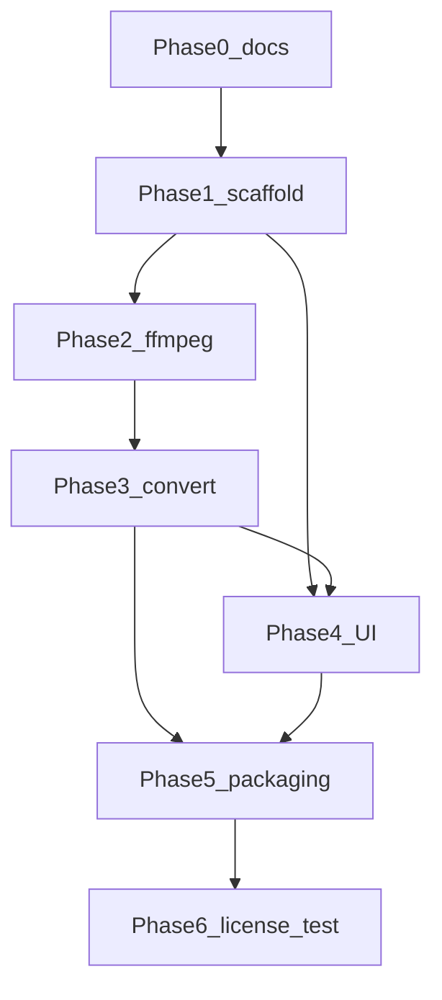

# タスク分解

実装に入るときのチェックリスト。各項目に完了条件を 1 行で付ける。

**Phase 0 が本リポジトリの現在のゴール。** Phase 1 以降は未着手。

## Phase 0 — 計画文書と公開

| ID | タスク | 完了条件 |
|----|--------|----------|
| T0-1 | 要件・設計・タスク・README・gitignore をリポジトリに置く | `docs/requirements.md` / `docs/design.md` / `docs/tasks.md` / `README.md` / `.gitignore` が存在する |
| T0-2 | GitHub に public リポジトリとして公開する | `https://github.com/ken-is-engineer/pixelart-converter` が public で、上記ファイルが `main` に載っている |

## Phase 1 — プロジェクト骨格

| ID | タスク | 完了条件 |
|----|--------|----------|
| T1-1 | Python パッケージレイアウト、依存（PySide6, Pillow）、実行エントリを用意する | 開発環境で空ウィンドウが起動する |
| T1-2 | 変換ジョブのデータモデル（入力、形式、共通・形式別オプション）を定義する | 要件 F-MP4 / F-IMG / F-CMN の項目がモデル上で表現でき、ループ回数と秒数を同時に持てない |
| T1-3 | ログとエラー種別の枠を用意する | UI から「分類されたエラー」を表示するフックがある（ダミーで可） |

## Phase 2 — 同梱 FFmpeg とエンコーダー

| ID | タスク | 完了条件 |
|----|--------|----------|
| T2-1 | LGPL・libx264 なしの FFmpeg ビルド手順を文書化し、`vendor/ffmpeg/` に成果物を置けるようにする | README に configure フラグとバージョンが書き残され、`ffmpeg -version` に libx264 が出ない |
| T2-2 | 同梱バイナリのパス解決（開発時 vendor / 梱包後 `_MEIPASS`）。PATH 上の ffmpeg は使わない | システムに別 ffmpeg があっても同梱側だけが呼ばれる |
| T2-3 | EncoderResolver: プローブと優先順（VideoToolbox / Media Foundation → 検討中の OpenH264） | macOS で `h264_videotoolbox`、Windows で `h264_mf` が選べる |
| T2-4 | OpenH264 の可否とプロファイルを実機検証し、採用ならビルドに含め、非採用なら要件・設計を更新する | HW が無い環境での方針が文書と実装で一致している |
| T2-5 | HW もフォールバックも無い場合は MP4 を失敗させる | GPL な ffmpeg に切り替えず、ユーザーへ理由が表示される |

## Phase 3 — 変換パス

| ID | タスク | 完了条件 |
|----|--------|----------|
| T3-1 | 共通: リサイズ（neighbor 既定）、出力ファイル名、メタデータ削除オン/オフ | 同一 GIF でサイズ維持と縮小が vis で確認でき、メタデータ削除オンでコメントが残らない |
| T3-2 | MP4: ループ回数指定 | 指定周回数だけ再生される MP4 が、HW エンコーダーで書き出される |
| T3-3 | MP4: 秒数指定 | 指定秒で切れ、足りない分は GIF が繰り返される |
| T3-4 | JPEG/PNG: 単一フレーム | 指定インデックスの 1 ファイルが出力される。範囲外は FFmpeg 前にエラー |
| T3-5 | JPEG/PNG: 複数・範囲・全フレームの連番 | `stem_%03d` 相当で欠けなく書き出される |
| T3-6 | GIF 再出力（palettegen/paletteuse、遅延維持） | リサイズ後の GIF がアニメーションし、著しい色化けがない |
| T3-7 | 進捗パースとキャンセル | 変換中に進捗が更新され、キャンセルでプロセスが止まり一時ファイルが残らない |

## Phase 4 — UI

| ID | タスク | 完了条件 |
|----|--------|----------|
| T4-1 | 入力選択、プレビュー（ニアレスト拡大）、幅・高さ・フレーム数の表示 | 典型的なピクセルアート GIF でプレビューがぼやけない |
| T4-2 | 出力形式に応じたオプションの出し分け（MP4 の排他、JPEG/PNG のフレーム指定） | 関係ないコントロールが操作できない |
| T4-3 | 共通オプションと変換・キャンセル・エラー表示をワーカー経由でつなぐ | 変換中に UI が固まらない |
| T4-4 | 複数出力時のファイル名説明（連番） | ユーザーが上書き先を誤解しない |

## Phase 5 — PyInstaller

| ID | タスク | 完了条件 |
|----|--------|----------|
| T5-1 | macOS `.app` に GUI・同梱 ffmpeg を入れ、署名なしでローカル起動できる | クリーンな Mac で Python なしに変換が通る |
| T5-2 | Windows `.exe`（onedir 優先候補）に同様に同梱する | クリーンな Windows で Python なしに変換が通る |
| T5-3 | onefile vs onedir、ウイルス誤検知の一次確認 | 採用した梱包方式がドキュメントに書かれている |
| T5-4 | コード署名・公証（後続。本フェーズ必須ではない） | 方針だけ issues / 文書に残っている |

## Phase 6 — コンプライアンスと手動テスト

| ID | タスク | 完了条件 |
|----|--------|----------|
| T6-1 | 配布物に Qt/PySide6/FFmpeg/Pillow 等のライセンス全文を同梱する | ユーザーがアプリ内またはフォルダから読める |
| T6-2 | FFmpeg LGPL に対するソース提供方法（URL またはアーカイブ）を同梱・記載する | 第三者ビルド手順とバージョンが一致している |
| T6-3 | 動的リンクの維持（PySide6 差し替え可能性）を梱包後に確認する | LGPL の動的リンク前提を壊していない |
| T6-4 | 手動テスト観点: 各出力形式、ループ/秒数、フレーム指定、リサイズ、メタデータ、キャンセル、エンコーダー失敗 | チェックリストを一度通して未達項目が issue 化されている |

## 依存関係（概要）

Phase 4 は Phase 3 の CLI/サービスが動いてから本接続する。ウィンドウ骨格だけは Phase 1 で先に作ってよい。
